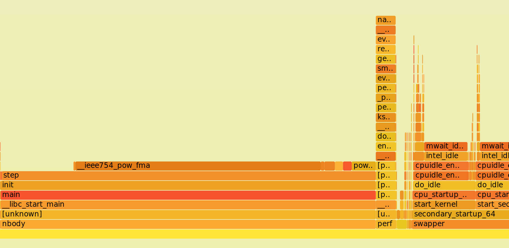
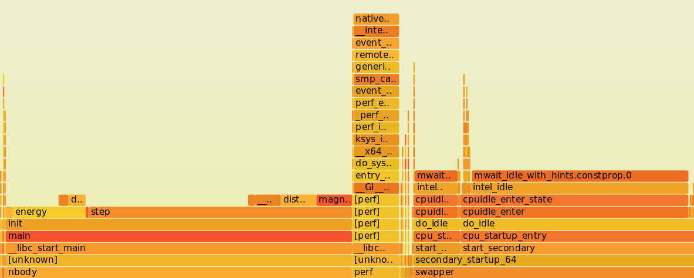
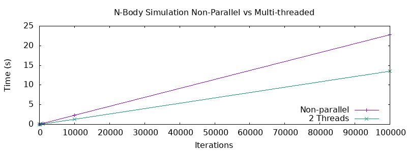
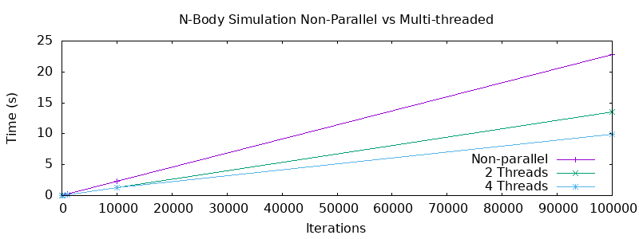
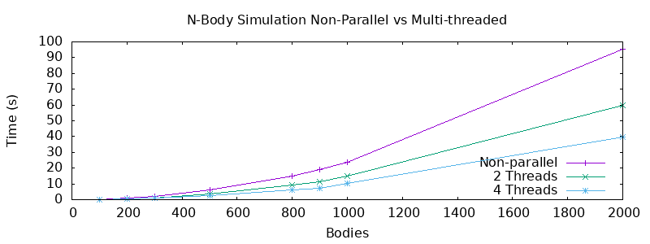
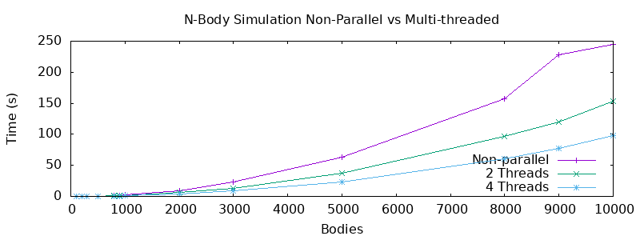
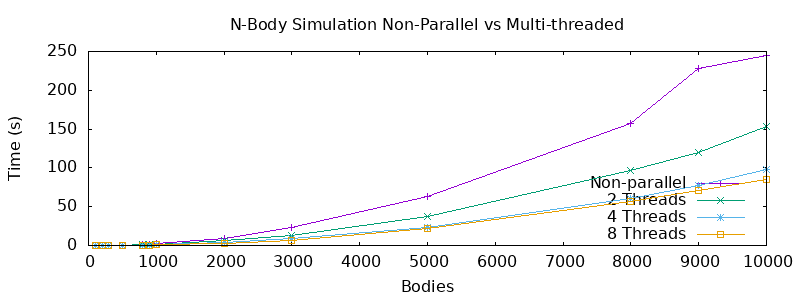

# N-Body Simulation

## Installation and Usage

1. Just clone this repository
2. Install dependencies - SDL2 libraries in order to run GUI simulation.

### NBody Command Line

1. Run command `make nbody`
2. Follow usage guide:

`Usage: ./nbody <iterations> <change_of_time> <-b n_bodies | -f file_name> [ -t N_THREADS ]\n`

Where:

- `-b <n_bodies>` is for generating random bodies
- `-f <csv_file>` is for generating bodies given a csv file

- `-t <N_THREADS>` symbolises threads with number 

### NBody GUI

1. Run command `make nbody-gui`
2. Follow usage guide:

`./nbody-gui <resolution_width> <resolution_height> <iterations> <dt> (-b <bodies> | -f <filename>) <scale>`

Where:

- `-b <n_bodies>` is for generating random bodies
- `-f <csv_file>` is for generating bodies given a csv file
- `<dt>` is for the amount to step for every iteration.
- `<scale>` is to scale the planets size

**NOTE dt has to be very large for the test csv**

### Testing (Validity, Timing and Perf)

1. Enter root directory
2. `chmod +x test.sh`
3. Run `./test.sh`  which will offer tests for timing, validity and perf.
4. See the `out` folder to view outputs from `perf` tests.

Moreover, the validity tester can be made separately using the `make test_functions` command.

## Description and Implementation

NOTE: With distances values = 0 a default value of `0.02` was given.

The N-body simulation project was an enjoyable endeavour into astrophysics simulations, specifically celestial body simulations. It also targeted knowledge of both single thread optimisations of memory and CPU, as well as parallel optimisations to mitigate issues of false sharing.

During the development of the single threaded implementation, it was quite straightforward to follow implementations for the distance and magnitude formulas. Apart from the obvious defensive checks, one that was noted, was with the issue of NaN values when the distance between two bodies is so close. If a distance of 0 was passed to the magnitude function one would obviously assume that there is a collision, however for the purpose of this project, collisions were mainly ignored. Hence any distance of 0 would instead be treated as `0.02`. What was interesting was whether to pass through a struct object of the body or rather pass through the values of the body's coordinates directly. When testing there didn't seem to be a performance difference whatsoever for the single threaded implementation however for the parallel implementation it seemed to increase times slightly.

The `step` and `energy` functions on the other hand were the most interesting to use and tweak for performance improvements. Initially the step function for the single threaded implementation would consist of a typical double for loop that would calculate for all `i = 0` to `i = N`  and compare with all values `j = 0` to `j = N` where `j != i` calculating the values of acceleration, velocity and position values.

 ```c
// Loop through all the bodies and calculate each step
for (size_t i = 0; i < len; i++) {
    // Loop through every other j
    for (size_t j = 0; j < len; j++) {
        if (j == i) continue; 	// Skip if same
        
        // Get the distance and the magnitude between the two bodies
        double dist = distance(bodies[j]->x, bodies[i]->x, bodies[j]->y, bodies[i]->y, bodies[j]->z, bodies[i]->z);

        // Get the magnitude of the two systems
        double mag = magnitude(bodies[j], bodies[i], dist);

        // Calculate the updated distances
        double x_dist = (bodies[i]->x - bodies[j]->x) / dist;
        double y_dist = (bodies[i]->y - bodies[j]->y) / dist;
        double z_dist = (bodies[i]->z - bodies[j]->z) / dist;

        // Calculate the updated accelerations
        double x_acc = (x_dist * mag) / mass;
        double y_acc = (y_dist * mag) / mass;
        double z_acc = (z_dist * mag) / mass;

        // Calculate the new velocity
        velocity_x += (x_acc * dt);
        velocity_y += (y_acc * dt);
        velocity_z += (z_acc * dt);

    }
    bodies[i]->velocity_x += velocity_x.... // For y and z as well
}
 ```

But interestingly an optimisation found while reading the problem outline again was that we could intertwine and update the velocity of the `jth` object while doing our `ith`. Hence we only needed `j` to start looping from `i + 1` instead. Effectively reducing our run time to $O(\frac{n(n + 1)}{2})$ which is $\in O(n^{2})$ but gives $\frac{n^{2} - n}{2}$ difference between this and the previous algorithm.

```c
// Loop through all the bodies and calculate each step
for (size_t i = 0; i < len; i++) {
    // Loop through every other j
    for (size_t j = i + 1; j < len; j++) {

        // Same as above
        
        // But here we calculate j's velocity as well
        bodies[j]->velocity_x += (((-1 * x_dist) * mag) / bodies[j]->mass) * dt;
        bodies[j]->velocity_y += (((-1 * y_dist) * mag) / bodies[j]->mass) * dt;
        bodies[j]->velocity_z += (((-1 * z_dist) * mag) / bodies[j]->mass) * dt;
    }
    
}
```

This distinction allows some huge benefits when trying to work with the parallel implementation. 


The implementation of the `energy` method was actually much smoother than anticipated after completing the `step` function. Based on the equation:
$$
e = \sum_{i = 0}^{N}(\frac{mass_{i} \cdot velocity_{i}^{2}}{2} - \sum_{j = i + 1}^{N}\frac{G \cdot mass_{i} \cdot mass_{j}}{magnitude_{ij}})
$$
This logically would follow suite of a double for loop, where every ith body is compared with every jth body in that sum. Hence the calculation would involve something akin to this:

```c
double energy = 0.0;
// Loop through all the bodies
for (size_t i = start; i < end; i++) {
    energy += (bodies[i]->mass * pow(bodies[i]->velocity_x, 2)) / 2;
    energy += (bodies[i]->mass * pow(bodies[i]->velocity_y, 2)) / 2;
    energy += (bodies[i]->mass * pow(bodies[i]->velocity_z, 2)) / 2;
    for (size_t j = i + 1; j < len; j++) {
        energy -= GCONST * (bodies[i]->mass * bodies[j]->mass) / distance(bodies[j]->x, bodies[i]->x, bodies[j]->y, b  odies[i]->y, bodies[j]->z, bodies[i]->z);
    }
}
```

Resulting in a calculation of the exact same time complexity of the `step` function $O(n^{2})$. But upon inspection of this, there were obvious changes that are discussed in [Performance Improvements](#Performance Improvements).

The rest of the codebase followed simple helper functions to help get file length, read the file, generate random bodies and manage iterations of the program. These functions did not seem necessary to optimised but rather I chose to focus on the optimisation of the four methods described above. 

The threaded implementation was difficult to work around without the use of atomics or locks. One of the ways initially was to directly copy the same function used for the single threaded implementation but to give a start and end index as parameters. However in order for this to work it required a guarantee of mutual exclusion such that when editing the `jth` body we are not accidentally modifying a value that another thread is reading, resulting in a data race. 

To stop this issue while guaranteeing a safe multi-threaded implementation it required reverting back to the original solution. In this scenario, it required passing the same start and end index but looping with the following conditions:

```c
void step_parallel(struct body** bodies, size_t len, size_t start, size_t end, double dt, pthread_barrier_t barrier) {
    for (size_t i = start; i < end; i++) {
        for (size_t j = 0; j < len; j++) {
            // CODE BELOW: ONLY CHANGING ITH BODY VELOCITY
        }
    }
    
    // Barrier here
	pthread_barrier_wait(&barrier);
    
    // Loop through finished when barrier is through
    for (size_t i = start; i < end; i++) {

        // If it is null continue
        if (bodies[i] == NULL) {
            continue;
        }
        bodies[i]->x += bodies[i]->velocity_x * dt;
        bodies[i]->y += bodies[i]->velocity_y * dt;
        bodies[i]->z += bodies[i]->velocity_z * dt;
    }
}
```

This resulted in a slight performance reduction compared to the unsafe implementation. Each thread would then calculate the updated positions without issue. However there is a predicament with just implementing this. The problem is that how do we know that each thread completes the for loop at the end at the same time, hence we would need a barrier at the end of the function as well to ensure that each thread as finished updating the positions such that the next iteration is not using older values.


### GUI Specifics

For the GUI, it was quite straightforward with determining how to correctly scale the window being a small nuisance. In the end it was decided to find the maximum x and y coordinates among the bodies and then use this as a ratio:

`double x_ratio = (width/(max_x + max_y));`

`double y_ratio = (height/(max_x + max_y));`

This ratio was sufficient enough for the simulation provided and some example ones. Moreover, for the scaling of the GUI, the `MAX_RADIUS` of the any body can be `20` pixels, and can be modified up to the user. Or for a more simplistic approach a scale of 1 means a max radius of `20` and a scale of 10 means `200` and so on. 

**NOTE: A positive y velocity means that the body will be travelling upwards, while a negative y velocity indicates downwards. In order to do this the y velocity component of all bodies had to be negated $\neg y$.**

## Performance & Improvements

NOTE: All these tests without indicated otherwise, call `energy` once initially and once at the end. When stated in some examples, `energy` will be called at each iteration.

Possible points of improvements in the original energy function were gradual. Initially it was chosen to do just a simple double for loop as discussed in the description. However, while scrutinising the codebase it seemed optimal to plug values as `register` for those that would be reused frequently. With only this small change it netted a performance boost on testing:

`./nbody 10000 0.1 -b 100` 

Previous = `~6s` 

Register = `5.77s`

But then logically we could apply this in most instances where a value is being changed and the same performance increases were found. Just with a slight modification of the `energy` function we get a surprising boost in performance:

```c
register double energy = 0.0;
// Loop through all the bodies
for (size_t i = start; i < end; i++) {

    register double mass = bodies[i]->mass;
    register double x = bodies[i]->x, y = bodies[i]->y, z = bodies[i]->z;
    energy += (mass * pow(bodies[i]->velocity_x, 2)) / 2;
    energy += (mass * pow(bodies[i]->velocity_y, 2)) / 2;
    energy += (mass * pow(bodies[i]->velocity_z, 2)) / 2;
    for (size_t j = i + 1; j < len; j++) {
        energy -= GCONST * (mass * bodies[j]->mass) / distance(bodies[j]->x, x, bodies[j]->y, y, bodies[j]->z, z);
    }
}

```

And with a larger input of `10000 0.1 -b 200`:

- original - `24.022`
- above code - `23.381`

When running with energy calls **at each step** we get for the original:

```
Test Single Thread: 100 0.1 -b 100
real    0m0.095s
user    0m0.095s
sys     0m0.000s

Test Single Thread: 1000 0.1 -b 100
real    0m0.916s
user    0m0.916s
sys     0m0.000s

Test Single Thread: 10000 0.1 -b 100
real    0m8.997s
user    0m8.989s
sys     0m0.000s

Test Single Thread: 100000 0.1 -b 100
real    1m34.381s
user    1m34.237s
sys     0m0.002s

```

And with the updated code:

```
Test Single Thread: 100 0.1 -b 100
real    0m0.095s
user    0m0.095s
sys     0m0.000s

Test Single Thread: 1000 0.1 -b 100
real    0m0.918s
user    0m0.916s
sys     0m0.001s

Test Single Thread: 10000 0.1 -b 100
real    0m8.863s
user    0m8.854s
sys     0m0.000s

Test Single Thread: 100000 0.1 -b 100
real    1m33.884s
user    1m33.536s
sys     0m0.002s
```

These performance changes are slight and rather an interesting application of `pow` is discussed below that provides surprising results.


Another particular one was with the velocity and mass values of the `ith` body within the step calculation. This ensures that we make use of cached memory effectively. The performance improvements in the single threaded implementation when this was done was not quite significant. Compared with the original code the changes included simply extracting the reused parameters of the body struct:

```c
// The total sum of the velocity so far
register double x = bodies[i]->x, y = bodies[i]->y, z = bodies[i]->z;
register double mass = bodies[i]->mass;
register double velocity_x = 0, velocity_y = 0, velocity_z = 0;
```

This value is passed through to the distance, and magnitude functions and used in calculations rather than accessing the values of the struct directly.

It would seem that it would have been wise to move straight to loop unrolling benefits but based on a flamegraph analysis of the original code base we notice something unique:



As shown in the flamegraph for the single threaded implementation of the original code base the majority of the time being spent is within the step function. But more interestingly  we see an excessive period of time devoted to the `pow` operation and hence it was decided to use multiplication rather than have to call `pow(x1 - x2, 2)` in all instances. This slight change produced spectacular results as shown below:

**Optimisation of Pow**

```c
return sqrt( (x1 - x2) * (x1 - x2) + (y1 - y2) * (y1 - y2) + (z1 - z2) * (z1 - z2));
```


In an example of two runs we see a significant performance boost compared to a register based modification without this `pow` change.

**Performance Comparison**

**WITH UPDATED POW**

```
Test Single Thread: 100 0.1 -b 100
real    0m0.026s
user    0m0.025s
sys     0m0.000s

Test Single Thread: 1000 0.1 -b 100
real    0m0.242s
user    0m0.237s
sys     0m0.000s

Test Single Thread: 10000 0.1 -b 100
real    0m2.328s
user    0m2.281s
sys     0m0.001s

Test Single Thread: 100000 0.1 -b 100
real    0m23.242s
user    0m23.062s
sys     0m0.001s                                                      
```

**USING ORIGINAL MATH POW**

```
Test Single Thread: 100 0.1 -b 100
real    0m0.095s
user    0m0.095s
sys     0m0.000s

Test Single Thread: 1000 0.1 -b 100
real    0m0.918s
user    0m0.916s
sys     0m0.001s

Test Single Thread: 10000 0.1 -b 100
real    0m8.863s
user    0m8.854s
sys     0m0.000s

Test Single Thread: 100000 0.1 -b 100
real    1m33.884s
user    1m33.536s
sys     0m0.002s
```

This improvement is very important and it was interesting that the throttle point was found through the analysis of the flamegraph.



This goes to show how only a small change in how the power is calculated gives completely different times.


**Threaded Performance**

When comparing the single threaded approach to the multi-threaded, it was difficult to correctly gauge how effective additional threads were since the algorithm in the non-parallel version was more efficient. Because it was decided against the use of locks for bodies it was difficult to update the values of the `jth` body in the context of the `ith` body without causing race conditions. However, even with this in mind the parallel approach did show improvement and as shown in the results below improved as the number of threads increased.

These results mapped increasing iterations with a non-parallel approach vs parallel (2 threads): `ITERATIONS 0.1 -b 100`

```
#Size   Non-Parallel    2 Threads
10      0.003           0.002
100     0.025           0.016
1000    0.254           0.149
10000   2.261           1.272
100000  22.814          13.493
```



As we increased the number of threads to 4 we see a slight increase in performance:

```
#Size   Non-Parallel    2 Threads       4 Threads
10      0.003           0.002           0.002
100     0.025           0.016           0.015
1000    0.254           0.149           0.137
10000   2.261           1.272           1.263
100000  22.814          13.493          9.943
```

But this will be partly due to the fact that iterations are not threaded while the number of bodies are divided amongst the threads. 



However the interesting benchmark testing is when the number of bodies are varied, because, recall the threads each take on a subset of the bodies. The resulting graph, interestingly, was akin to the above with the number of iterations:




And as the number of threads increase, it is clear to see that there is an improvement in performance as the number of bodies are increased.

```
#Size   Non-Parallel    2 Threads       4 Threads
100     0.254           0.149           0.137
200     0.975           0.550           0.433
300     2.180           1.254           0.884
500     6.036           3.590           2.430
800     15.074          9.301           6.262
900     19.191          11.589          7.22
1000    23.567          14.867          10.486
2000    95.472          59.667          39.896          
```

If the number of iterations are dropped down to `100` we can view the impact of varying bodies in more detail:

```
#Size   Non-Parallel    2 Threads       4 Threads
100     0.029           0.016           0.011
200     0.110           0.057           0.038
300     0.236           0.119           0.072
500     0.612           0.325           0.194
800     1.518           0.889           0.502
900     1.920           1.124           0.633
1000    2.395           1.436           0.938
2000    9.477           5.957           3.947
3000    22.794          13.011          8.547
5000    62.714          36.752          23.681
8000    157.082         96.202          60.584
9000    227.558         119.234         76.789
10000   244.662         153.796         97.701  
```

Viewing the graph of the above results, we can see the substantial performance improvements by adding in more threads.



But as with any scenario it reaches a point where the introduction of more and more threads causes more overhead and waiting times for the barrier. 



As an extension, the `energy` function was experimented with because I felt that the division of work between threads could have been improved. For instance, the old implementation had every thread given an equal subset wherein actual fact the number of iterations was not $n^2$ but rather $\frac{n^{2} + n}{2}$. Hence we could give each thread a number of bodies such that they only have a number of possible iterations, excluding the final thread, $iterations\geq \frac{n^{2} + n}{2 * threads}$.


**EXTRA**: It would be interesting to see the generation of bodies using threads such that each thread uses the row-major order property of C to help reduce time required in random body generation. This idea could also be applied to reading the file where each thread can be given a starting file ptr index and an ending one such that each one works on reading a section of the file.

Moreover Fourier transforms can be used here to manipulate the fact that some calculations are much more efficient to perform on them. Other specific optimisations for n-Body simulations include the Barnes-Hut Simulation which uses octree's as well as ignoring bodies that are negligible in the calculation of the step function for the ith body.